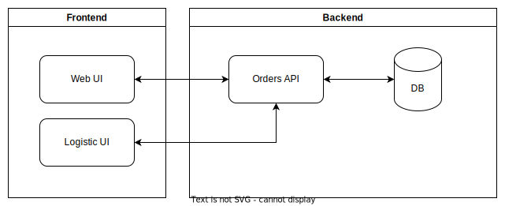

# La pasta e-commerce

  

I like Pasta, I'm always hungry and I'm looking for a sample project to exercise all the new .NET features.
Those are the reasons why I'm doing this small Pasta e-commerce.

This project has a very simple goal: selling Pasta. But we'll do it in the most over-engineered way possible. because why not.

## Architecture and functionalities

Edit the architecture diagram [here](https://app.diagrams.net/?title=la-pasta.drawio#R1VfbjpswEP0aHluBuSR5zHW7baJdKap299GBKbg1GBkToF9fE0wAkZJU26SNxANzZvDlzJyx0cx5mD9wHAcb5gHVkO7lmrnQEDIshLTy0b2iQka2VQE%2BJ54KaoAt%2BQkK1BWaEg%2BSTqBgjAoSd0GXRRG4ooNhzlnWDfvGaHfWGPvQA7Yupn30hXgiqNAxGjX4JyB%2BUM9sOJPKE%2BI6WO0kCbDHshZkLjVzzhkT1VuYz4GW5NW8VN%2BtfuM9LoxDJC75YPrI7Sh1v2wCc7NebnP%2F8yv6YKu1iaLeMHhy%2F8pkXATMZxGmywadcZZGHpSj6tJqYtaMxRI0JPgdhChUMnEqmIQCEVLllQvmxav6%2FmC8lcZHuzYXedu5KJSVCMzFtEyqBFyKk4S4NbwitB6%2BT4ziKmEpd2GADVMVGOY%2BiIE4VcIlVa0JFO0PwEKQy5YBHCgWZN8tJawq0j%2FGNUmTLypvf5BDpxp3j2mqZpph9wdEXi%2B3SUZCiiMYImkPXEA%2BuC3lNU3Fg5K2UVd61gjFnCgsaIkEWfqVqBj1qFjM%2BiwEOC5f3YISWcjclHRkARGwjfGhPDLZyroVu6tKfr07ApJh%2FyCEp1TIYUDhSVXzhn2S4sH0Xcw7cvQO73afducE6%2BNrkT6%2Bpx5ysJ6BE7l34O9tLEMJPdttrAu7zei%2F6jZWT2JPXIookdj0%2BbFXCk2ijfMyu5Zi7K5gnL5gjr2rrRjnWoox0L%2BVTKOSt7bvbx%2B771KHUd%2F27uswrpfd0sea%2BSQRkjOkf70PgRgnjpQbK2TSo3HFWSSuf6sx9PO3GqTf9FZj9rh4gd3tqumYi4s5tG7Wb7WyLOo%2FqIOv9R9qLn8B).

### Frontend Web UI

- Show products
- Add products to cart
- Pay and send orders
- Sign-in / Register

### Orders API

- Provide products
- Handle order creation
- Send customer communications
- Sign-in / Register

### Logistic UI

- Show orders
- Change order status

## Main database

- Contains users and orders
